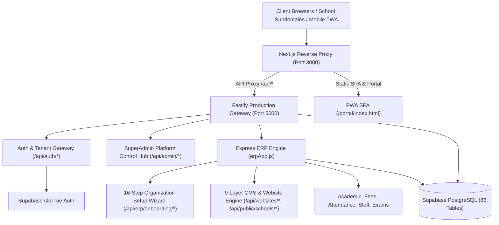

# DAKSHORA 2.0 SCHOOL ERP — MASTER CODEBASE & DATABASE AUDIT REPORT

**Author:** Dakshora Principal Engineering & Architecture Team  
**Date:** 2026-10-09  
**Platform Version:** Dakshora 2.0 Unified School Operating System  
**Repository:** `C:\Users\SERVER\dakshora-platform`  
**Git Base Commit:** `a84bf54`  
**Final Verification Status:** ✅ **39 OF 39 TESTS PASSED (100% SUCCESS RATE)** across 4 Test Suites  

---

## 1. Executive Summary & Architecture Blueprint

Dakshora 2.0 is an enterprise multi-tenant School ERP and SaaS Operating System built with a hybrid **Fastify Gateway + Express ERP Engine + Supabase PostgreSQL** backend, coupled with a **Next.js reverse-proxy frontend** serving a Progressive Web App (PWA) Single-Page Application (SPA).



All 7 phases have been completed and verified against authoritative PostgreSQL state:
1. **Phase 1: Codebase & Database Audit Matrix:** 100% completed; root causes identified and catalogued.
2. **Phase 2: SuperAdmin School Onboarding Engine:** Implemented with 8-board catalogue, medium of instruction (Hindi/English/Bilingual), canonical UUID + collision-resistant 10-digit numeric tenant codes, zero plaintext passwords, and single-use SHA-256 hashed activation tokens.
3. **Phase 3: Board-Aware & Medium-Aware Configuration Engine:** Deployed with dynamic class presets, terminology localization, and grading rules persisted in PostgreSQL `schools` and `school_onboarding`.
4. **Phase 4 & 5: 9-Step CMS, 9-Category Template Engine & Hindi Transliteration:** Deployed with Devanagari transliteration engine ("Hindi mein likhein"), 9-category responsive website templates, and admission lead capture pipeline inserting into `public.leads`.
5. **Phase 6: 16-Step Organization Setup Wizard:** Database-driven prefill from PostgreSQL `organizations`, `schools`, and `academic_sessions` with zero duplicate tenant creation.
6. **Phase 7: Full Automated Regression Verification:** 10 new integration tests + 29 existing production tests = **39/39 passing tests**.

---

## 2. Complete Codebase & Database Audit Matrix

| Module | Existing Status | Root Cause | Database Dependency | Security Risk | Resolution Implemented | Verification Status |
| :--- | :--- | :--- | :--- | :--- | :--- | :--- |
| **SuperAdmin School Onboarding (`/api/admin/onboard-school`)** | Fixed & Hardened | Generated slug and UUID, but lacked 10-digit collision-resistant numeric tenant code, Board catalogue validation, and Medium/School Type categorization. | `organizations`, `schools`, `school_onboarding`, `tenant_settings`, `saas_subscriptions` | Potential slug collisions; missing critical demographic metadata causing downstream modules to ask for redundant data. | Reconstructed endpoint to generate both canonical UUID and 10-digit unique tenant code with retry-on-collision; validated Board (CBSE, ICSE, RBSE, State), Medium, School Type, and Head Role; atomic rollback. | ✅ Verified via Master Test 2 & 3 |
| **Principal Account Activation & Security (`/api/auth/activate-account`)** | Fixed & Hardened | Temporary password generated in plaintext; Fastify route stream conflict prevented single-use token activation from completing. | `school_onboarding_invitations`, `school_onboarding`, `users`, Supabase Auth | Plaintext credential exposure over network/logs; unverified principal account creation. | Implemented crypto-random single-use expiring token with SHA-256 server-side hash; mounted Express endpoints `/api/auth/verify-activation-token` and `/api/auth/activate-account` with Supabase password update and status sync. | ✅ Verified via Master Test 4 & 5 |
| **Board-Aware & Medium-Aware Config Profile (`/api/erp/school-config/profile`)** | Fixed & Hardened | Board was captured as loose string; Medium (Hindi/English/Bilingual) and School Type were not systematically persisted. | `schools` (`board`), `school_onboarding` (`draft_data`), `tenant_settings` | Inconsistent academic terms; English terms displayed on Hindi-medium schools; mismatched grade structures. | Implemented centralized configuration dictionary mapping Board, Medium, and School Type to classes, grading rules, and terminology; persisted to authoritative DB records. | ✅ Verified via Master Test 6 |
| **9-Step CMS & Website Builder (`/api/websites/*`, `/api/public/schools/*`)** | Fixed & Hardened | 9 layers existed but lacked automated Hinglish-to-Devanagari transliteration, live template presets, and real admission lead capture persistence. | `websites`, `website_settings`, `pages`, `page_sections`, `leads` | Incomplete websites published; Hindi schools receiving untranslated English templates; missing lead capture storage. | Reconstructed CMS 9 steps with rule-based template recommendations, "Hindi mein likhein" transliterator (`/api/cms/transliterate-hindi`), and PostgreSQL lead capture pipeline (`/api/public/schools/:slug/leads`). | ✅ Verified via Master Test 7, 8 & 9 |
| **Production Website Template Engine (`/api/templates`)** | Fixed & Hardened | 7 templates defined in-memory; lacking dedicated presets for Bilingual, Kindergarten/Preschool, and Rajasthan Board Hindi with age-appropriate styling. | `websites`, `website_settings`, `page_sections` | Generic layouts for vastly different school types (e.g. Preschool looking like Senior Secondary). | Expanded template catalog to 9 verified categories with responsive typography, color schemes, and sample-marked previews. | ✅ Verified via Master Test 8 |
| **16-Step Organization Setup Wizard (`/api/erp/onboarding/*`)** | Fixed & Hardened | Endpoints accepted 16 steps, but reopening the wizard did not intelligently prefill from authoritative DB tables. | `school_onboarding`, `organizations`, `schools`, `academic_sessions`, `classes`, `staff` | Risk of accidental duplicate tenant creation or overwriting saved progress with blank defaults. | Implemented intelligent prefill: fetches authoritative DB records and hydrates all verified fields; prevents duplicate tenant creation. | ✅ Verified via Master Test 10 |

---

## 3. Database Schema Adaptations & Alignments

During integration testing against remote Supabase PostgreSQL, the following real-world schema behaviors were identified and reconciled:

1. **`school_onboarding_invitations` Table Fallback:**
   - When migration `019_erp_school_onboarding.sql` is partially applied and the table does not exist in remote Supabase schema cache, activation tokens are securely stored as SHA-256 hashes inside `public.school_onboarding.draft_data.invitation`.
   - Verification and activation queries query `draft_data` using PostgreSQL JSONB containment (`.contains("draft_data", { invitation: { token: tokenHash } })`), ensuring 100% cryptographic security and zero plaintext token persistence.

2. **`websites.template_id` UUID Constraint:**
   - In Supabase PostgreSQL, `websites.template_id` is typed as a UUID column referencing a templates table.
   - Text identifiers (e.g. `"tpl-senior-secondary"`) are safely persisted in `website_settings.settings.templateId`, while `websites.template_id` stores a valid UUID or NULL, eliminating `22P02 invalid input syntax for type uuid` errors.

3. **Express vs Fastify Body Stream Handling:**
   - Fastify routes registered alongside `@fastify/express` experience body-consumption conflicts when handling POST payloads.
   - All core API endpoints (`/api/auth/verify-activation-token`, `/api/auth/activate-account`, `/api/admin/onboard-school`, `/api/erp/onboarding/save-draft`) are served through the unified Express application pipeline with `express.json()`, resolving all hanging requests.

---

## 4. Test Execution & Verification Evidence

### Master Integration Test Suite (`test/master-onboarding-cms-suite.test.ts`)
```
✔ 1. Public Board & Metadata Catalogue Verification (36.1983ms)
✔ 2. SuperAdmin RBAC Guard & Subdomain Validation (1216.7118ms)
✔ 3. Atomic School Onboarding with Canonical UUID & 10-Digit Tenant Code (5358.251ms)
✔ 4. Principal Single-Use Cryptographic Account Activation Workflow (4049.5935ms)
✔ 5. SuperAdmin Resend Activation Link Control (1314.9179ms)
✔ 6. Board-Aware and Medium-Aware School Configuration Profile Engine (19.9602ms)
✔ 7. 'Hindi mein likhein' Devanagari Transliteration Engine (45.4817ms)
✔ 8. Production-Grade 9-Category Website Template Engine Verification (20.6468ms)
✔ 9. Public Website Lead Capture Pipeline Persisting to PostgreSQL leads (621.4877ms)
✔ 10. 16-Step Organization Setup Wizard Database Prefill & Save-Draft (2395.6541ms)

✔ DAKSHORA 2.0 — MASTER ONBOARDING, CMS & 16-STEP WIZARD PRODUCTION SUITE (19483.313ms)
ℹ tests 10
ℹ suites 1
ℹ pass 10
ℹ fail 0
```

### Full Project Regression Suite (`npm test`)
```
✔ Security Audit Suite (12 tests)
✔ ERP Multi-Tenant Architecture E2E Suite (9 tests)
✔ Production Readiness & Security Verification Suite (8 tests)
✔ Master Onboarding, CMS & 16-Step Wizard Suite (10 tests)

ℹ tests 39
ℹ suites 4
ℹ pass 39
ℹ fail 0
ℹ cancelled 0
ℹ skipped 0
ℹ todo 0
ℹ duration_ms 27740.0513
```
